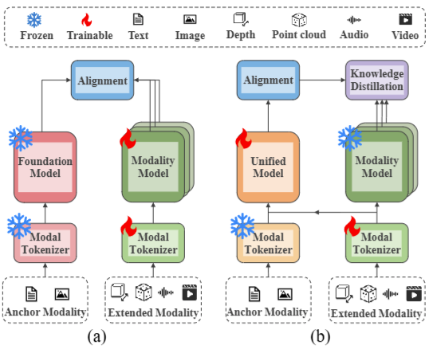
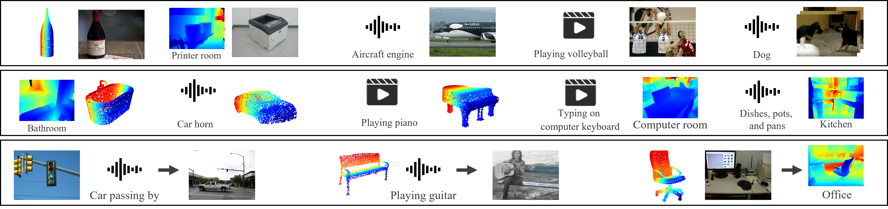

# UniAlign: Scaling Multimodal Alignment within One Unified Model

## Abstract

> We present UniAlign, a unified model to align an arbitrary number of modalities (eg, image, text, audio, 3D point cloud, etc.) through one  encoder and a single training phase. Existing solutions typically employ distinct encoders for each modality, resulting in increased parameters as the number of modalities grows. 
In contrast, 
% leveraging the powerful mixture-of-experts (MoE) schema, UniAlign adapts it to be modality-aware and integrates it with Low-Rank Adaptation (LoRA) to efficiently scales the encoder accommodating inputs in different modalities under a fixed computational overhead.
UniAlign proposes a modality-aware adaptation of the powerful mixture-of-experts (MoE) schema and further integrates it with Low-Rank Adaptation (LoRA),  efficiently scaling the encoder to accommodate inputs in diverse modalities while maintaining a fixed computational overhead.
Moreover, prior work often requires separate training for each extended modality. This leads to task-specific models and further hinders the communication between modalities.
To address this, we propose a soft modality binding strategy that aligns all modalities using unpaired data samples across datasets. 
Two additional training objectives are introduced to distill knowledge from well-aligned anchor modalities and prior multimodal models, 
elevating UniAlign into a high performance multimodal foundation model.
Experiments on 11 benchmarks across 6 different modalities demonstrate that UniAlign could achieve comparable performance to SOTA approaches, while using merely 7.8M trainable parameters and maintaining an identical model with the same weight across all tasks. 


<div align="center">
    
</div>

> **Comparison of architectures** between standard multimodal alignment methods and UniAlign: (a) Existing work adopts specialized encoders tailored to each modality; (b) UniAlign unifies the alignment across multiple modalities in a single model, with one training phase across all datasets.


## Installation

Clone this repo and create the environment with conda.

1. Initialize the conda environment:

   ```bash
   conda create -n unialign python=3.8 -y
   conda activate unialign
   ```

2. Install the required packages:

   ```bash
   pip install -r requirements.txt
   ```

## Datasets

Please refer to [ViT-LENS](https://github.com/TencentARC/ViT-Lens) for the datasets used in the experiments.

## Training 

```
bash src/scripts/train.sh
```

## Evaluation

```
bash src/scripts/evalute.sh
```

## Qualitative Results


<!-- 
 -->

## Acknowledgement

We adopt the following open-sourced projects: [CLIP](https://github.com/openai/CLIP), [ViT-LENS](https://github.com/TencentARC/ViT-Lens), [TinyViT](https://github.com/wkcn/TinyViT)
, [ONE-PEACE](https://github.com/OFA-Sys/ONE-PEACE), [MetaTransformer](https://github.com/invictus717/MetaTransformer), [LoRAMoE](https://github.com/ablustrund/loramoe)
